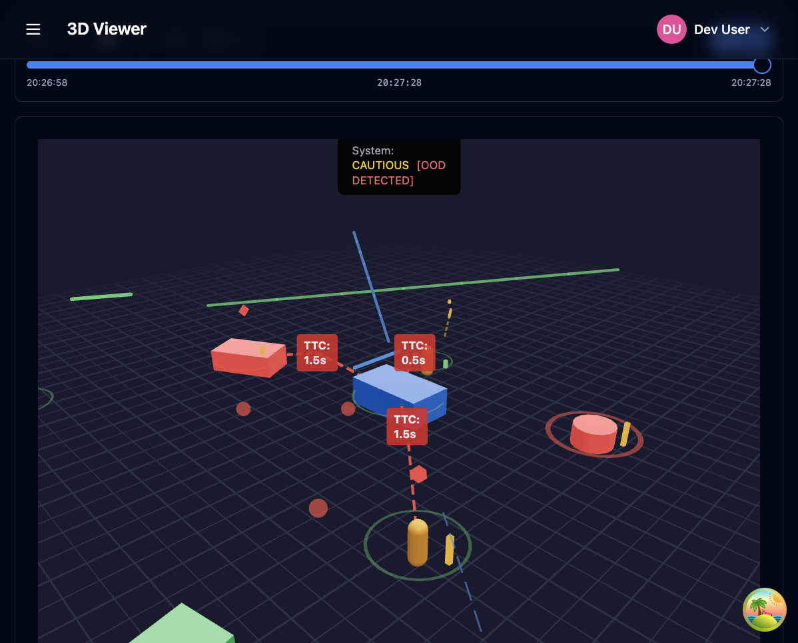

# OpenTLU: Trustworthy Learning in Uncertainty

<div align="center">

**A rigorous engineering framework for building Trustworthy Learning-Based Models (LBMs) that operate reliably under uncertainty, distribution shift, and open-world conditions.**

[](https://www.python.org/downloads/)
[](https://www.typescriptlang.org/)
[](LICENSE)
[](frontend/TEST_COVERAGE_SUMMARY.md)

</div>

---

## Overview

OpenTLU is a comprehensive framework designed to address the critical challenges of deploying machine learning models in safety-critical applications. It provides robust mechanisms for uncertainty quantification, safety filtering, runtime monitoring, and active learning to ensure reliable operation under uncertainty and distribution shift.

### Key Capabilities

- **Uncertainty Quantification**: Decompose uncertainty into aleatoric and epistemic components with conformal prediction guarantees
- **Safety Filtering**: Enforce safety constraints and envelopes to prevent unsafe actions
- **Runtime Monitoring**: Real-time health monitoring with Out-of-Distribution (OOD) detection
- **Active Learning**: Intelligent sample selection based on uncertainty, risk, and novelty
- **Statistical Evaluation**: Rigorous evaluation metrics with stratified analysis
- **3D Visualization**: Interactive dashboard for real-time system monitoring and analysis



*The OpenTLU dashboard provides real-time visualization of uncertainty metrics, safety monitoring, and 3D scene analysis with out-of-distribution detection.*

---

## Table of Contents

- [Features](#features)
- [Architecture](#architecture)
- [Installation](#installation)
- [Quick Start](#quick-start)
- [Usage Examples](#usage-examples)
- [API Documentation](#api-documentation)
- [Development](#development)
- [Testing](#testing)
- [Docker Deployment](#docker-deployment)
- [Project Structure](#project-structure)
- [Contributing](#contributing)
- [License](#license)
- [Author](#author)

---

## Features

### Core Components

#### 1. **Foundations** (`src/opentlu/foundations/`)
- **Uncertainty Types**: Aleatoric vs epistemic uncertainty decomposition
- **Risk Metrics**: Comprehensive risk assessment and quantification
- **Conformal Prediction**: Statistical guarantees for prediction sets
- **Contracts**: Safety contracts and guarantees

#### 2. **Safety** (`src/opentlu/safety/`)
- **Safety Filters**: Constraint-based action filtering
- **Safety Monitors**: Real-time safety monitoring and alerting
- **Envelopes**: Box and linear constraint definitions
- **Mitigation**: Automatic fallback and mitigation strategies

#### 3. **Runtime** (`src/opentlu/runtime/`)
- **Controller**: Closed-loop mitigation and control
- **OOD Detection**: Out-of-distribution event detection
- **Health Monitoring**: System health and performance tracking
- **Logging**: Structured logging for observability

#### 4. **Evaluation** (`src/opentlu/evaluation/`)
- **Engine**: Evaluation orchestration and execution
- **Statistics**: Stratified statistical analysis
- **Deployment**: Production deployment evaluation

#### 5. **Active Learning** (`src/opentlu/active_learning/`)
- **Acquisition**: Uncertainty-based sample selection
- **Continual Learning**: Online learning and adaptation
- **Ranking**: Multi-criteria sample ranking

### Frontend Features

- **Interactive Dashboard**: Real-time metrics and visualizations
- **3D Viewer**: Immersive 3D scene visualization with uncertainty rings
- **Scenario Management**: Create, manage, and evaluate scenarios
- **Safety Monitoring**: Real-time safety status and alerts
- **Active Learning Interface**: Sample selection and labeling workflows
- **Comprehensive Test Coverage**: >95% test coverage with Vitest and React Testing Library

---

## Architecture

OpenTLU follows a modular architecture with clear separation between backend (Python/FastAPI) and frontend (React/TypeScript):

```
┌─────────────────────────────────────────────────────────────┐
│                      Frontend (React)                        │
│  ┌──────────┐  ┌──────────┐  ┌──────────┐  ┌──────────┐   │
│  │Dashboard │  │3D Viewer│  │Scenarios │  │  Safety  │   │
│  └──────────┘  └──────────┘  └──────────┘  └──────────┘   │
│                                                              │
│  ┌──────────────────────────────────────────────────────┐  │
│  │         React Query + Zustand State Management        │  │
│  └──────────────────────────────────────────────────────┘  │
└───────────────────────────┬─────────────────────────────────┘
                            │ REST API
┌───────────────────────────▼─────────────────────────────────┐
│                   Backend (FastAPI)                         │
│  ┌──────────┐  ┌──────────┐  ┌──────────┐  ┌──────────┐   │
│  │Foundations│ │  Safety  │  │ Runtime  │  │Evaluation│   │
│  └──────────┘  └──────────┘  └──────────┘  └──────────┘   │
│                                                              │
│  ┌──────────────────────────────────────────────────────┐  │
│  │         Uncertainty | Safety | Active Learning        │  │
│  └──────────────────────────────────────────────────────┘  │
└──────────────────────────────────────────────────────────────┘
```

---

## Installation

### Prerequisites

- **Python**: 3.10 or higher
- **Node.js**: 18.x or higher
- **pnpm**: 8.x or higher (or npm/yarn)
- **uv**: Modern Python package manager (recommended) or pip

### Backend Installation

Using `uv` (recommended):
```bash
uv sync
```

Or using `pip`:
```bash
pip install -e .[dev]
```

### Frontend Installation

```bash
cd frontend
pnpm install
```

### Development Dependencies

For full development setup:
```bash
# Backend dev dependencies
uv sync --extra dev

# Frontend dev dependencies (included in pnpm install)
cd frontend && pnpm install
```

---

## Quick Start

### 1. Start Development Servers

Start both backend and frontend concurrently:

```bash
./scripts/start-dev.sh
```

Or manually:

```bash
# Terminal 1: Backend
PYTHONPATH=src python3 -m opentlu.server

# Terminal 2: Frontend
cd frontend && pnpm dev
```

The frontend will be available at `http://localhost:5176` (or next available port) and the backend at `http://localhost:8000`.

### 2. Run Tests

**Backend:**
```bash
# Run all tests
pytest tests/unit/

# Run with coverage
pytest tests/unit/ --cov=src/opentlu --cov-report=html

# Run integration tests
pytest tests/integration/
```

**Frontend:**
```bash
cd frontend

# Run unit tests
pnpm test

# Run with coverage (enforced at 95%)
pnpm test:coverage

# Run E2E tests
pnpm test:e2e
```

### 3. Access the Dashboard

Navigate to `http://localhost:5176` in your browser. The application uses mock data in development mode via Mock Service Worker (MSW), so no backend connection is required for initial exploration.

---

## Usage Examples

### Python API

#### Safety Filtering

```python
import numpy as np
from opentlu.safety.filter import SafetyFilter, BoxConstraint
from opentlu.foundations.contracts import SafetyEnvelope

# Define safety constraints
box = BoxConstraint(lower=np.array([-1.0]), upper=np.array([1.0]))
envelope = SafetyEnvelope(source="demo", constraints=["box_limit"])

# Initialize filter
safety_filter = SafetyFilter(envelope=envelope, box_constraints=[box])

# Filter unsafe actions
unsafe_action = np.array([2.5])
result = safety_filter.filter(unsafe_action)
print(f"Original: {unsafe_action}")
print(f"Filtered: {result.action}")
print(f"Modified: {result.was_modified}")
```

#### Uncertainty Estimation

```python
from opentlu.foundations.uncertainty import UncertaintyEstimate
from opentlu.foundations.contracts import RiskAssessment

# Generate uncertainty estimate
estimate = UncertaintyEstimate(
    confidence=0.85,
    aleatoric_score=0.15,
    epistemic_score=0.20,
    source="ensemble_variance"
)

# Assess risk
risk = RiskAssessment(
    uncertainty=estimate,
    threshold=0.3,
    level="moderate"
)
```

#### Active Learning

```python
from opentlu.active_learning.acquisition import AcquisitionFunction

# Configure acquisition
acquisition = AcquisitionFunction(
    weight_uncertainty=0.5,
    weight_risk=0.3,
    weight_novelty=0.2
)

# Rank samples
samples = [...]  # Your unlabeled samples
ranked = acquisition.rank(samples)
```

### Frontend API

The frontend provides React hooks for interacting with the backend:

```typescript
import { useUncertaintyEstimate } from '@/hooks/useUncertainty';
import { useScenarios } from '@/hooks/useEvaluation';
import { useSafetyStatus } from '@/hooks/useSafety';

// Fetch uncertainty estimate
const { data: uncertainty, isLoading } = useUncertaintyEstimate('default');

// Fetch scenarios
const { data: scenarios } = useScenarios({ page: 1, pageSize: 10 });

// Get safety status
const { mitigationState, status, triggeredCount } = useSafetyStatus();
```

See `notebooks/usage_demo.ipynb` for comprehensive examples.

---

## API Documentation

### Backend API

The FastAPI backend provides a RESTful API with automatic OpenAPI documentation:

- **Swagger UI**: `http://localhost:8000/docs`
- **ReDoc**: `http://localhost:8000/redoc`

### Key Endpoints

- `GET /api/health` - Health check
- `GET /api/uncertainty/estimate` - Get uncertainty estimate
- `GET /api/uncertainty/history` - Get uncertainty history
- `GET /api/scenarios` - List scenarios
- `POST /api/scenarios` - Create scenario
- `POST /api/evaluate` - Run evaluation
- `GET /api/safety/monitors` - Get safety monitors
- `GET /api/active-learning/samples` - Get active learning samples

### Frontend API Client

The frontend uses a typed API client (`frontend/src/lib/api/client.ts`) with automatic request/response validation using Zod schemas.

---

## Development

### Project Structure

```
OpenTLU/
├── src/opentlu/              # Backend Python package
│   ├── foundations/         # Uncertainty, metrics, contracts
│   ├── safety/              # Safety filtering and monitoring
│   ├── runtime/             # Runtime control and OOD detection
│   ├── evaluation/          # Evaluation engine and statistics
│   ├── active_learning/     # Active learning and acquisition
│   ├── visualization/       # Dashboard data generation
│   └── server.py            # FastAPI application
├── frontend/                # React/TypeScript frontend
│   ├── src/
│   │   ├── components/     # React components
│   │   ├── hooks/          # React Query hooks
│   │   ├── stores/         # Zustand state management
│   │   ├── lib/            # Utilities and API client
│   │   └── pages/          # Page components
│   └── e2e/                # Playwright E2E tests
├── tests/                   # Backend tests
│   ├── unit/               # Unit tests
│   └── integration/        # Integration tests
├── notebooks/               # Jupyter notebooks and demos
├── docs/                    # Documentation
└── scripts/                # Utility scripts
```

### Code Quality

**Backend:**
- **Type Checking**: `mypy` with strict mode
- **Linting**: `ruff` for fast Python linting
- **Testing**: `pytest` with `hypothesis` for property-based testing
- **Formatting**: `ruff format`

**Frontend:**
- **Type Checking**: TypeScript with strict mode
- **Linting**: ESLint with React/TypeScript rules
- **Testing**: Vitest with React Testing Library
- **E2E Testing**: Playwright
- **Formatting**: Prettier

### Development Workflow

1. **Create a feature branch**: `git checkout -b feat/your-feature`
2. **Make changes**: Follow the code style and add tests
3. **Run tests**: Ensure all tests pass
4. **Commit**: Use conventional commits (`feat:`, `fix:`, `docs:`, etc.)
5. **Push**: `git push origin feat/your-feature`
6. **Create PR**: Follow the PR template in `.github/pull_request_template.md`

---

## Testing

### Backend Testing

```bash
# Run all tests
pytest

# Run specific test file
pytest tests/unit/test_safety.py

# Run with coverage
pytest --cov=src/opentlu --cov-report=html

# Run integration tests
pytest tests/integration/

# Run with tox (multiple Python versions)
tox
```

### Frontend Testing

```bash
cd frontend

# Unit tests
pnpm test

# Watch mode
pnpm test:watch

# Coverage (enforced at 95%)
pnpm test:coverage

# E2E tests
pnpm test:e2e

# E2E with UI
pnpm test:e2e:ui
```

### Test Coverage

- **Frontend**: >95% coverage enforced (see `frontend/vitest.config.ts`)
- **Backend**: Comprehensive unit and integration test coverage
- **Coverage Reports**: Generated in `frontend/coverage/` and `htmlcov/`

See `frontend/COVERAGE_SCOPE.md` for details on coverage exclusions.

---

## Docker Deployment

### Quick Start with Docker Compose

```bash
# Build and start all services
docker compose up --build

# Run in detached mode
docker compose up -d

# View logs
docker compose logs -f

# Stop services
docker compose down
```

### Individual Services

**Backend:**
```bash
docker build -t opentlu-backend .
docker run -p 8000:8000 opentlu-backend
```

**Frontend:**
```bash
cd frontend
docker build -t opentlu-frontend .
docker run -p 5176:5176 opentlu-frontend
```

### Environment Variables

Create a `.env` file for configuration:

```env
# Backend
API_HOST=0.0.0.0
API_PORT=8000
LOG_LEVEL=INFO

# Frontend
VITE_API_URL=http://localhost:8000
```

---

## Mock Data

The frontend uses Mock Service Worker (MSW) for development and testing:

- **Development**: Automatically enabled in DEV mode
- **Testing**: Configured in `frontend/src/tests/setup.ts`
- **Handlers**: Defined in `frontend/src/tests/mocks/handlers/`
- **Factories**: Mock data generators in `frontend/src/tests/mocks/factories.ts`
- **Presets**: Common scenarios in `frontend/src/tests/mocks/presets.ts`

All API endpoints are mocked with realistic data, ensuring consistent development and testing experiences.

---

## Contributing

We welcome contributions! Please see our contributing guidelines:

1. **Fork the repository**
2. **Create a feature branch**: `git checkout -b feat/amazing-feature`
3. **Follow code style**: Run linters and formatters before committing
4. **Add tests**: Ensure new features have test coverage
5. **Update documentation**: Keep README and docs up to date
6. **Commit**: Use conventional commits (`feat:`, `fix:`, `docs:`, etc.)
7. **Push**: `git push origin feat/amazing-feature`
8. **Open a Pull Request**: Follow the PR template

### PR Guidelines

- Keep PRs focused and reviewable
- Include tests for new features
- Update documentation as needed
- Ensure all CI checks pass
- Follow the PR template in `.github/pull_request_template.md`

See `docs/PUBLISHING.md` for detailed publishing guidelines.

---

## License

This project is licensed under the MIT License - see the [LICENSE](LICENSE) file for details.

---

## Author

**Nik Jois**  
Email: nikjois@llamasearch.ai

---

## Acknowledgments

- Built with [FastAPI](https://fastapi.tiangolo.com/) for the backend
- Built with [React](https://react.dev/) and [TypeScript](https://www.typescriptlang.org/) for the frontend
- Uses [Three.js](https://threejs.org/) for 3D visualization
- Uses [Mock Service Worker](https://mswjs.io/) for API mocking
- Uses [Vitest](https://vitest.dev/) and [Playwright](https://playwright.dev/) for testing

---

## Related Projects

- [OpenRXN](https://github.com/llamasearchai/openrxn-catalyst) - Catalyst design platform
- [OpenPerturbation](https://github.com/llamasearchai/openperturbation) - Perturbation analysis framework

---

<div align="center">

**OpenTLU** - Building trustworthy AI systems for uncertain worlds

[Documentation](docs/) • [Issues](https://github.com/llamasearchai/OpenTrustworthyLearningUnderUncertainty/issues) • [Discussions](https://github.com/llamasearchai/OpenTrustworthyLearningUnderUncertainty/discussions)

</div>
